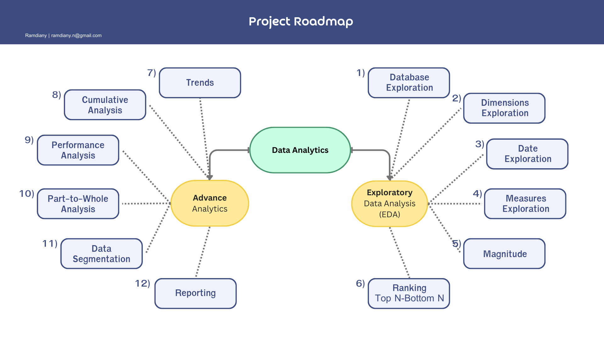

# 📊 SQL Data Analytics Project

Welcome to my SQL Data Analytics Project!  
This repository showcases end-to-end exploratory data analysis and business reporting using SQL Server. The project focuses on transforming raw transactional data into meaningful business insights.

---

## 🧠 Skills Demonstrated

- SQL data cleaning & transformation  
- Exploratory Data Analysis (EDA)  
- Aggregations & window functions  
- Customer and product performance analysis  
- Business KPI reporting  
- Query optimization & structured query design  
- Analytical thinking & insight generation  

---

## 🗺️ Project Roadmap

Below is the roadmap followed during the project:

---

## 🛠️ Tools & Resources

- **Database:** Microsoft SQL Server  
- **Language:** SQL (T-SQL)  
- **Environment:** SQL Server Management Studio (SSMS)  
- **Dataset Type:** Sales / Transactional Data Warehouse  

---

## 📌 Project Requirements

This project answers key business questions derived from the final analytical reports:

### 👥 Customer Report
- Who are the most valuable customers?
- What is each customer's purchase behavior?
- Customer lifetime value indicators
- Purchase frequency and recency
- Customer product diversity

### 📦 Product Report
- Best-selling products
- Revenue contribution by product
- Product demand trends over time
- Product performance ranking
- Quantity vs revenue analysis

The SQL scripts build structured queries to generate these insights from raw sales data.

---

## 📂 Repository Structure

sql-data-analytics-project/
│
├── datasets/ # Raw or reference datasets
│
├── documents/
│ └── project_roadmap.png # Project workflow visualization
│
├── scripts/
│ ├── 00_init_database.sql
│ ├── 01_database_exploration.sql
│ ├── 02_dimensions_exploration.sql
│ ├── 03_date_range_exploration.sql
│ ├── 04_measures_exploration.sql
│ ├── 05_magnitude_analysis.sql
│ ├── 06_ranking_analysis.sql
│ ├── 07_change_over_time_analysis.sql
│ ├── 08_cumulative_analysis.sql
│ ├── 09_performance_analysis.sql
│ ├── 10_data_segmentation_analysis.sql
│ ├── 11_part_to_whole_analysis.sql
│ ├── 12_customer_report.sql
│ └── 13_product_report.sql
│
└── README.md

---

## 👋 About Me

Hi there! I'm **Novia Noer Ramdiany**. I’m passionate about data and turning raw numbers into meaningful insights.

Let’s stay in touch!  
Feel free to connect with me on LinkedIn:  
🔗 https://www.linkedin.com/in/noviaramdiany/

---

⭐ If you find this project interesting, feel free to explore the queries and reach out!
